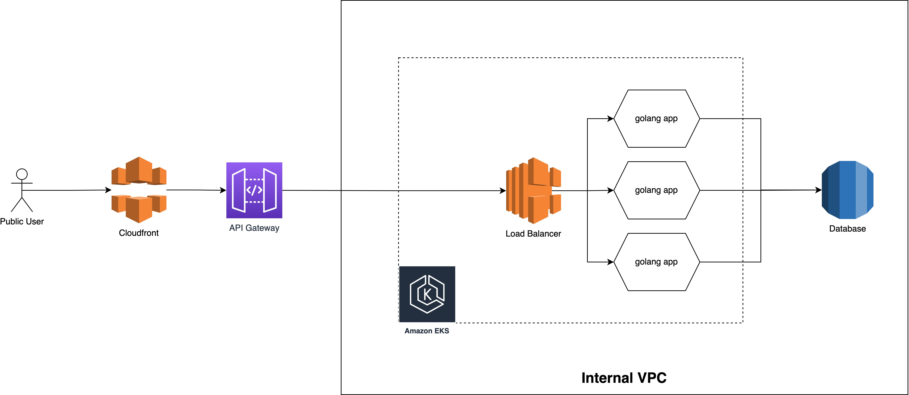

# high-available-server

## Summary

This repo demonstrates a simple golang application deployment to kubernetes.
Application is written in golang and for simplicity, we use map as datastore.
As we use repository interface, we just need to switch the implementation should we need persistence using SQL DB,
cache, or NoSQL.

## Pre-Requisites

- Golang
- Minikube
- Helm
- Docker

## Directory Structure

```markdown
deployment
|--- helm chart for deployment to kubernetes
handler
|--- golang handler functions
model
|--- application structs
script
|--- custom scripts for deployment and testing API
```

## How to Run Locally

To run the application alone, use go run command

```shell
go run main.go 
```

Stop the application by pressing Ctrl+C or Command+C

## How to Run in Kubernetes (minikube)

We provided script to build and deploy application to kubernetes using minikube.
Make sure [minikube](https://minikube.sigs.k8s.io/docs/start/) is installed and already started

```shell
minikube start
```

Then we need to build the docker image using this script:

```shell
./script/build.sh
```

We can specify the tag for the image by passing first argument when executing the script. When no argument provided, by
default it will use the short hash commit ID.

Once we have the image, we can deploy it using helm. Run this script to deploy application:

```shell
./build/deploy.sh
```

Similar to the build script, we can also pass custom image tag as first argument.

Use `kubectl get pods` to see the deployed application.

## High Availability

The deployment CRD is defined to deploy 3 pods for high availability. Even though the service doesn't configure graceful
shutdown, having 3 pods provides redundancy and higher availability. During deployment, pod will not be completely
unavailable. Fast application startup also guarantee minimum downtime. However, once the application startup get slower,
we need a graceful shutdown mechanism and liveness check. Graceful shutdown will make sure all threads has been
finished (no killed request) and livenees probe will make sure application ready before accepting traffic. Basically
liveness probe can be achieved using healthcheck.

## API

Available API:

- PUT /hello/{user_id} -d '{"dateOfBirth: "YYYY-MM-DD"}'
- GET /hello/{user_id}

Curl is available on `./script/put.sh` and `./script/get.sh`

If we run the application on kubernetes, we can use port-forward to expose it locally

```shell
kubectl port-forward service/high-available-server-service 8080:8080
```

## What's Missing

The basic block of this application is generated using ChatGPT and developed iteratively after according to needs. The
idea is 100% my own thoughts based on my experience. However, for fast
prototyping I decided to let ChatGPT write everything based on my idea. Then I tweak it by myself according to my needs.
However, there are still missing items that need to be developed to make sure application has a high quality:

- unit/integration test
- repo interface
- graceful shutdown
- liveness probe
- proper load test

## Cloud Deployment Diagram



The diagram above show how the application can be deployed to AWS EKS. Kubernetes cluster is deployed in internal VPC.
Application is deployed behind AWS Application load balancer and can be scaled horizontally for high availability. For
more reliable datastore, we can use AWS managed service like AWS RDS as persistence storage or AWS ElastiCache as cache.

Application can be accessed publicly by exposing the endpoint through API Gateway. For extra security we integrate
the API gateway with cloudfront.